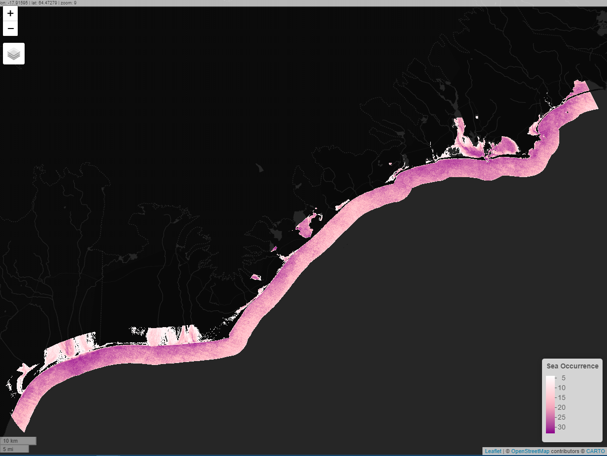
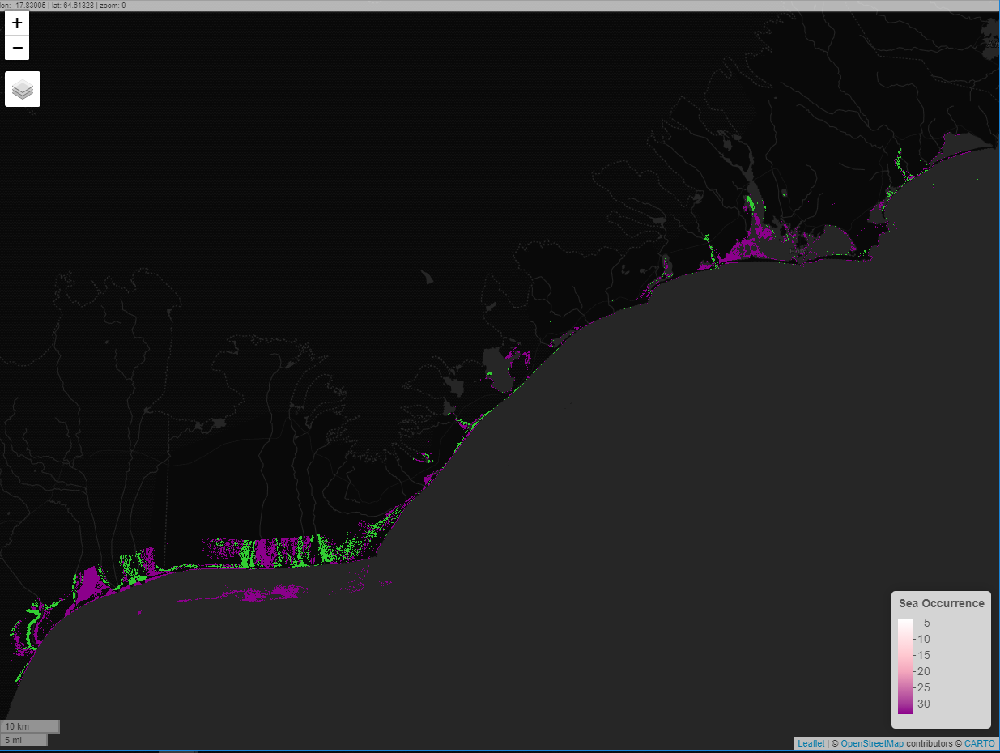
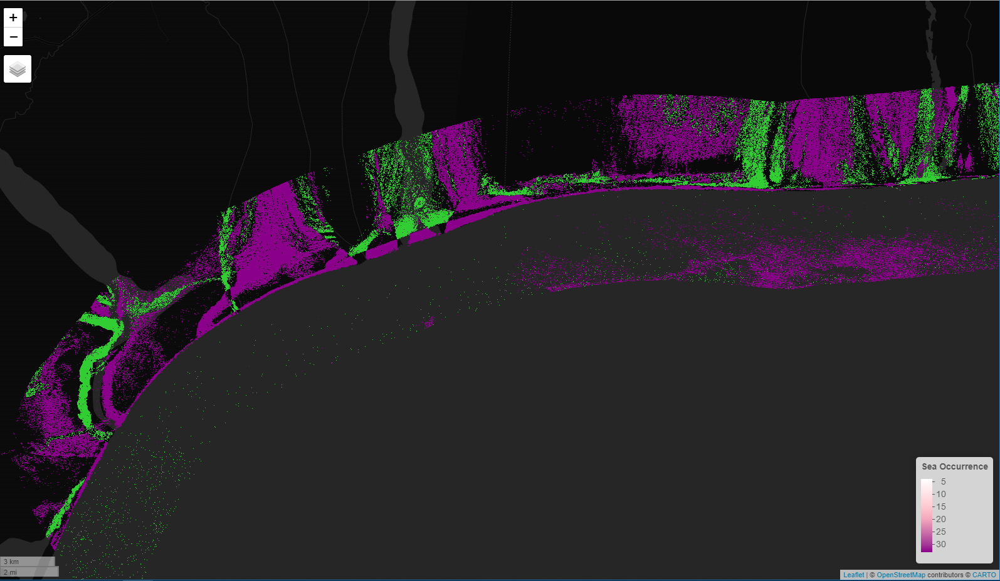
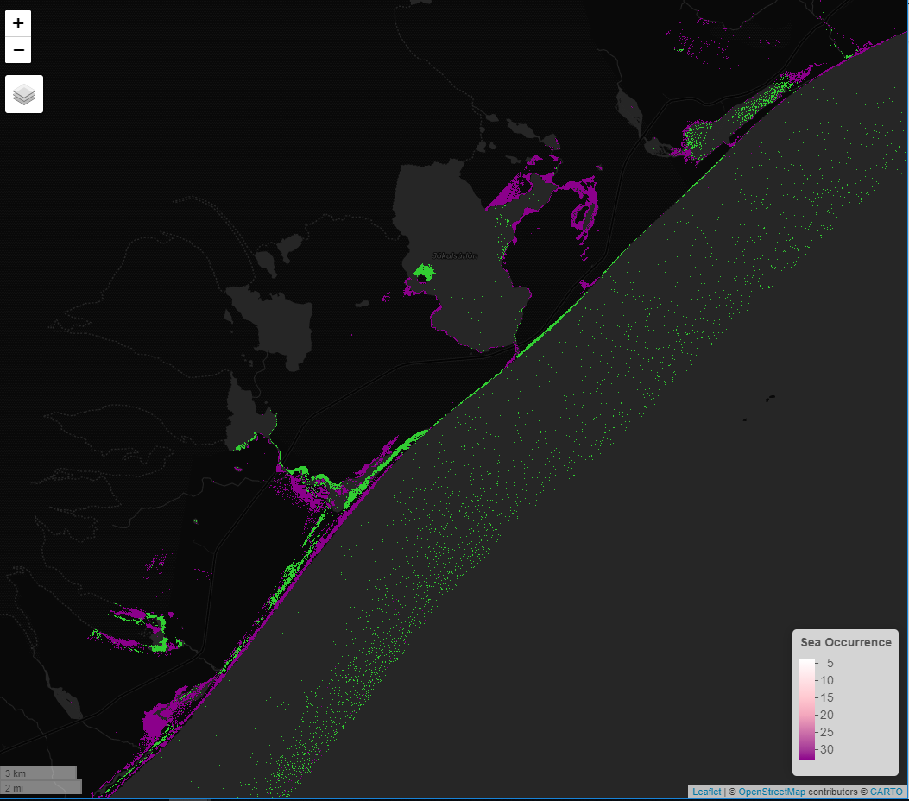
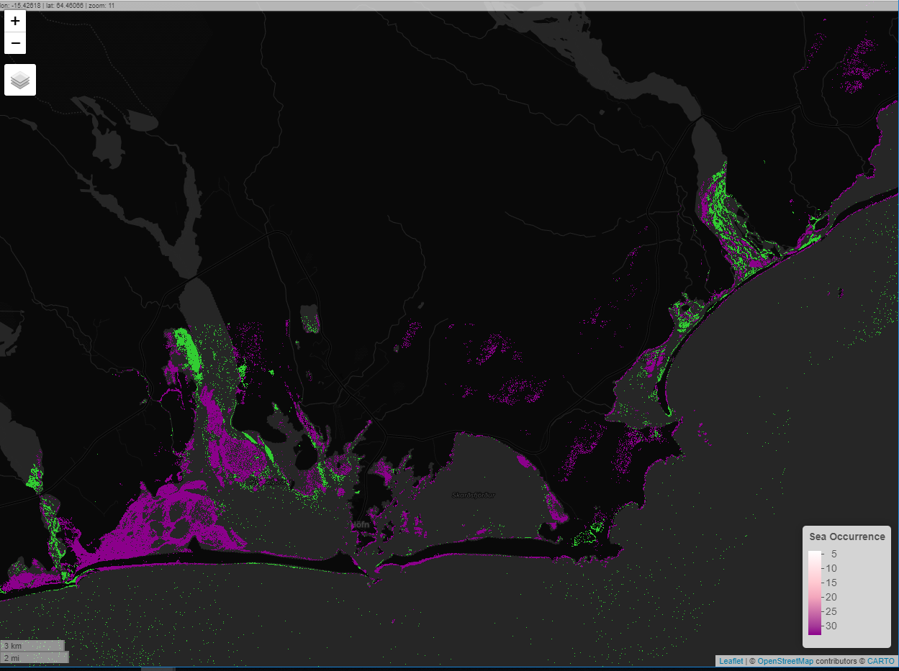
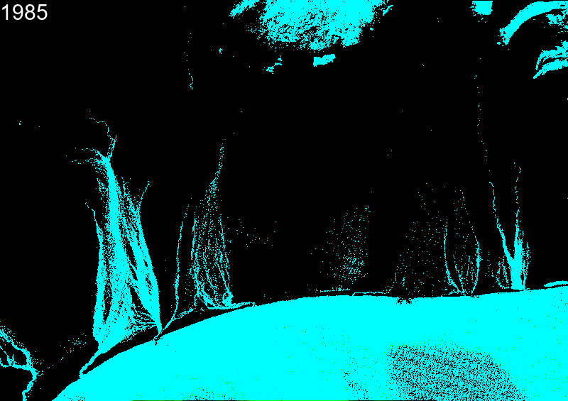
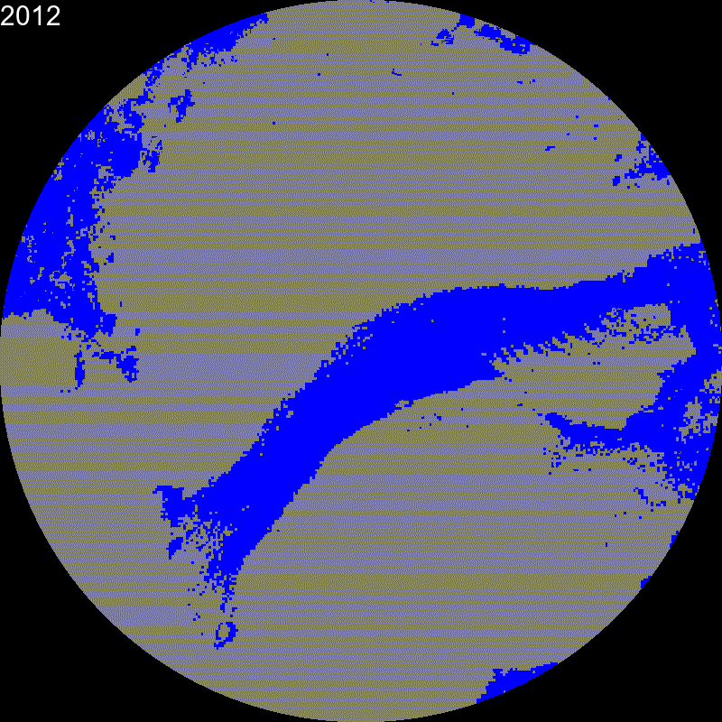

Notes
================

Extra information or thoughts during the analysis are documented in this
file.

## **Thoughts on analysis**
### Comparisons with JRC - GSW
The global surface water (GSW) from the Joint Research Center (JRC) is available on EE. According to its [documentation](https://storage.googleapis.com/global-surface-water/downloads_ancillary/DataUsersGuidev2.pdf) the data products include two interesting items that are also analyzed in this study for the study area in Iceland: *water occurrence* and *occurrence change intensity*. 

Direct comparisons can be performed with the first product and the analysis presented here, particularly the `seaOccurrence` object from *3\_ts\_shoreline.R*. For the second product, direct analysis is not possible since they choose epochs  between 1984-1999 and 2000-2015, while in this study we perform 7 different epochs from 1985 to 2020 to show changes more precisely. However, the inspiration on comparing epochs comes from the GSW work. 

#### Some preliminary results of the water extraction:

#### Preliminary results on Epoch differences: 1985-1990 and 2015-2020 

Green: New water, Purple: New land (ignore the legend on the image)

### Remarks from shoreline time series
Subsets are defined from the analysis performed in *3\_ts\_shoreline.R*, where main changes are observed during the epoch and occurrence analysis. 

#### The defined subsets are: 

1. [Skeiðarársandur](https://en.wikipedia.org/wiki/Skei%C3%B0ar%C3%A1rsandur)

Big amounts of changes specially after the 1996 Jökulhlaup, it is worth taking a look at the GLOF back then, and at the new lakes developing at the edge of the Glacier. Linkage to [Grímsvötn](https://en.wikipedia.org/wiki/Gr%C3%ADmsv%C3%B6tn) past and recent activity should be a focus. 

2. [Breiðamerkursandur](https://en.wikipedia.org/wiki/Brei%C3%B0amerkursandur)

Changes on the sandspit might be linked to the glacier lake development. An abrupt change of water discharge direction is observed between 1988 and 1989, and continues to evolve until 2020. Potential changes closer to Jökullsárlón are also worth checking.

3. [Jökulsársandur](https://www.carto.net/andre.mw/photos/2009/07/16_b_selvik_jokulsa_i_loni/20090716-165256_eskifell_und_joekulsarsandur_bei_jarnhnaus.shtml)

There are several changes on the river and probably there are changes on the sediment load at the dunes.

### Next steps

1. Extract water mask time series for each subset
Most probably indices and thresholds need to be adjusted to each subset, since the areas are fairly different in spectral variance. E.g. the outwash plains are very dark and often confused with water, but if only that area is analyzed and not the whole glacier area, better results can be expected.

2. Quantify erosion rates at shoreline and glacier retreat for each subset
As the main sources of "constant" change that can be extracted from the time series analysis. Due to limitations with imagery, epochs might be again here a good solution for quantification.

3. Identify main changes in water discharge systems for each subset
Changes in glacier lakes, river mouths, and river flow directions. It might be possible to identify specific years of major change, that can then be linked to specific events (GLOFS, volcanic activity, earthquakes, extreme weather events, etc.).

## **Possible limitations**
### Landsat data availability

Due to cloud coverage over Iceland, along with a gap in RS imagery from L5 sensors from ~2000 to ~2007, and the known strip issue for L7, several gaps are found in the data. Although a complete collection can be built for the "discharge" AOI, the coverage of the area is not complete. Main issues in data gaps are observed for the following years: 

- Whole area not covered: 1996, 1998
- Partial coverage: 
    - SE of Vatnajokull: 1992, 1993, 1999
    - S and SW of Vatnajokull: 2002
    - SW of Vatnajokull: 2007
    - Mouth of Skafta River (SW): 2001
    - Scaterred cloud masks: 2012
- Problems with cloud coverage and image quality: 2016, 2017

#### Example of data limitation - Subset A 1985-2020:

For this reason the analysis is performed by epochs, although particular issues can be encountered on the epoch 1995-2000, so it should be analyzed with care. 

### Cloud masking

Clouds are difficult to deal with in Iceland. First, the quality of the mosaic will change depending on the Cloud Cover threshold used, also on the percentile selected for the reducer. 

The following have been attempted but so far no good solution is found:

1. [TOA] Compute the simple cloud score with EE Landsat algorithms 

Was working relatively fine but the Cirrus effect was complicating water extraction, that is why the analysis was switched to SR.

2. [TOA & SR] Use the Bitmask for masking

There is a documented problem with the CFMASK algorithm for polar areas, mainly due to snow and ice (glacier marginals are falsely masked). There are methods to correct this but not implemented on GEE, so probably will not pursue that. 

3. [TOA & SR] Use NDCI for masking

Not successful, the masking might actually work for water extraction (!) check...

4. [TOA & SR] Use brightness for masking

This was an experimental idea, to also mask out glaciers, but the outcome was not so satisfactory. 

### Dark pixels (outwash-plains)

Outwash plains and black sand keep being detected as water. I tried removing them with Brightness, but then open-sea water was masked out as well, which is problematic for change detection.

## **Extra pieces of code**

  
Click to expand

  
  ### Explore results as `stars` objects
  
  Useful when tehere are weird rendering issues on EE Maps. Important to
  note that exporting large areas takes to much effort so the testing
  region should be small enough. Object `sea` comes from file
  *3\_ts\_shoreline.R*
  
      region_test = st_sfc(st_point(x = c(-17.48817,63.76833)), crs = 4326) %>% 
        st_transform(3857) %>% st_buffer(10000, endCapStyle = 'SQUARE') %>% st_transform(4326) %>% 
        sf_as_ee()
        
      sea_stars = sea$filter(ee$Filter$eq('year', 2013))$first() %>% 
         ee_as_stars(region = region_test, scale = 30)
  
  ### Forward differencing
  
  This is meant to compute differences between each epoch and its
  predecesor. Currently it is done manually for each epoxh of interest.
  
  Running the code below causes an error: `'computedObject' not callable`.
  Probably worth opening an issue in `rgee`. The code comes from [this
  StackOverflow answer](https://gis.stackexchange.com/a/300475/137193)
  with license CC BY-SA 4.0.
  
  Other options could be [working with
  arrays](https://r-spatial.github.io/rgee/articles/BestPractices.html#use-forward-differencing-for-neighbors-in-time-1)
  but I am not so familiar with this yet and I cannot find good examples
  for my case.
  
      epochsMeanList = epochsMean %>%
        ee$List()
      epochsDiff = epochsMeanList$slice(0,-1)$
        zip(epochsMeanList$slice(1))$
        map(ee_utils_pyfunc(function(f){
        ee$Image(ee$List(f)$get(1))$subtract(ee$Image(ee$List(f)$get(0)))
      }))

## **Change log**

### 23/09/2020
- I am working now with SR, avoiding this cirrus effect. 
- Corrected change between epochs to really reflect changes. Results are much better and insightfull. 
- Also water extraction is improved, MNDWI is not used any more to extract water pixels. 
- Big question: how to get rid of outwash plains but not of sea water, brightness is not an option (it removes open-sea water which is not convenient for the change detection)
- NDCI is not working to remove clouds

## **Extras...**

Sinasvajokull rockfall - 2012-2020

I realized the rockfall is visible in my analysis. 2016 has clouds, so we could think of merging Sentinel-2 imagery also? 

